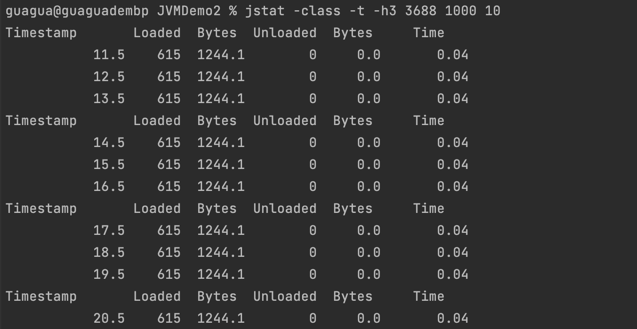
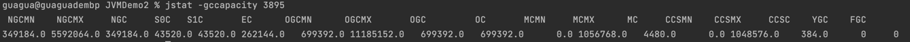
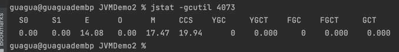
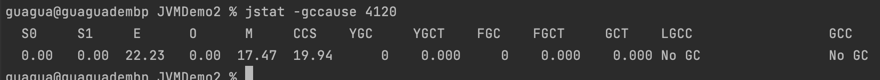
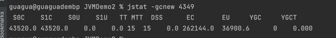
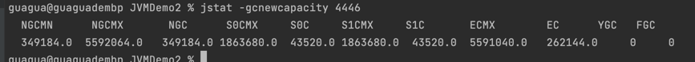
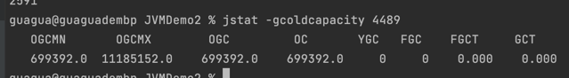
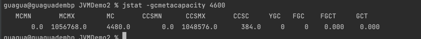

## jstat (JVM statistics monitoring tool) 显示虚拟机各种运行状态信息，显示本地或远程类装载，内存，垃圾收集，JIT编译等运行数据

### 基本参数
- jstat -[option] [-t] [-h<lines>] <vmid> [<interval> [<count>]]

| 参数        | 说明             |
|-----------|----------------|
| -t        | 程序启动到当前的总运行时间  |
| -h<lines> | 每隔lines次答应一次表头 |
| vmid      | 进程id           |
| interval  | 每隔多就打印一次，单位毫秒  |
| count     | 总共打印次数         |

- 命令执行
```shell
jstat -class -t -h3 3089 1000 10
```


### GC参数
```shell
jstat -gc 3089
```
| 参数   | 说明                                                       |
|------|----------------------------------------------------------|
| -gc  | 显示gc相关堆信息，包括eden区，两个survivor区，老年代，永久代等的容量，已用空间，GC时间合计等信息 |


- 结果参数说明

| 参数   | 说明                           |
|------|------------------------------|
| S0C  | 第一个幸存者区大小，单位字节               |
| S1C  | 第二个幸存者区大小，单位字节               |
| S0U  | 第一个幸存者区已使用大小，单位字节            |
| S1U  | 第二个幸存者区已使用大小，单位字节            |
| EC   | Eden空间大小，单位字节                |
| EU   | Eden空间已使用大小，单位字节             |
| OC   | 老年代空间大小，单位字节                 |
| OU   | 老年代已使用大小，单位字节                |
| MC   | 方法区大小，单位字节                   |
| MU   | 方法区已使用大小，单位字节                |
| CCSC | 压缩类空间大小，单位字节                 |
| CCSU | 压缩类已使用空间大小，单位字节              |
| YGC  | 从应用程序启动到采样时 yong gc次数        |
| YGCT | 从应用程序启动到采样时 yong gc消耗的时间，单位秒 |
| FGC  | 从应用程序启动到采样时 full gc次数        |
| FGCT | 从应用程序启动到采样时 full gc消耗的时间，单位秒 |
| GCT  | 从应用程序启动到采样时 gc 总时间           |

```shell
jstat -gccapacity 3089
```
| 参数          | 说明                                |
|-------------|-----------------------------------|
| -gccapacity | 与-gc显示内容大致相同，主要关注堆中各个区域最小，最大使用空间  |

- 结果参数说明

|参数| 说明  |
| ----|-----|
|NGCMN|     |
|NGCMX||
|NGC||
|S0C||
|S1C||
|EC||
|OGCMN||
|OGCMX||
|OGC||
|OC||
|MCMN||
|MCMX||
|MC||
|CCSMN||
|CCSMX||
|CCSC||
|YGC||
|FGC||

```shell
jstat -gcutil 3089
```
| 参数      | 说明                              |
|---------|---------------------------------|
| -gcutil | 与-gc显示内容大致相同，主要输出已使用空间占总空间的百分比  |


- 结果参数说明

| 参数   | 说明  |
|------|-----|
| S0   |     |
| S1   ||
| E    ||
| O    ||
| M    ||
| CCS  ||
| YGC  ||
| YGCT ||
| FGC  ||
| FGCT ||
| GCT  ||

```shell
jstat -gccause 3089 
```
| 参数        | 说明                                  |
|-----------|-------------------------------------|
| -gccause  | 与-gcutil功能一样，主要输出最后一次或当前正在发生gc产生的原因 |


| 参数   | 说明  |
|------|-----|
| S0   ||
| S1   ||
| E    ||
| O    ||
| M    ||
| CCS  |
| YGC  ||
| YGCT ||
| FGC  ||
| FGCT ||
| GCT  ||
| LGCC ||
| GCC  ||

```shell
jstat -gcnew 3089
```
| 参数     | 说明        |
|--------|-----------|
| -gcnew | 显示新生代gc情况 |


| 参数   | 说明   |
|------|------|
| S0C  |      |  
| S1C  ||
| S0U  ||
| S1U  ||
| TT   ||
| MTT  ||
| DSS  ||
| EC   ||
| EU   ||
| YGC  ||
| YGCT || 

- 显示与-gcnew大致相同，主要关注使用到的最大，最小空间
```shell
jstat -gcnewcapacity 3089
```


| 参  数  | 说明  |
|-------|-----|
| NGCMN ||
| NGCMX ||
| NGC   ||
| S0CMX ||
| S0C   ||
| S1CMX ||
| S1C   ||
| ECMX  ||
| EC    ||
| YGC   ||
| FGC   ||

- 显示老年代gc情况
```shell
jstat -gcold 3089
```


| 参数     | 说明    |
|--------|-------|
| -gcold | 3089  |  
| MC     ||
| MU     ||
| CCSC   ||
| CCSU   ||
| OC     ||
| OU     ||
| YGC    ||
| FGC    ||
| FGCT   ||
| GCT    ||

- 显示与-gcold大致相同，主要关注使用到的最大，最小空间
```shell
jstat -gcoldcapacity 3089 
```


| 参数    | 说明  |
|-------|-----|
| OGCMN ||
| OGCMX ||
| OGC   ||
| OC    ||
| YGC   ||
| FGC   ||
| FGCT  ||
| GCT   ||

- 显示元空间使用到的最大，最小空间
```shell
jstat -gcmetacapacity 3089
```


| 参数    | 说明   |
|-------|------|
| MCMN  ||       
| MCMX  ||
| MC    ||
| CCSMN ||
| CCSMX ||
| CCSC  ||
| YGC   ||
| FGC   ||
| FGCT  ||
| GCT   ||

